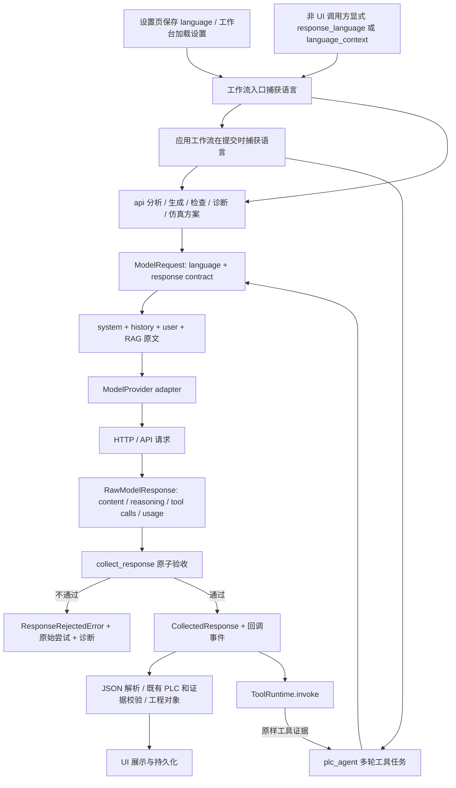

# 模型响应语言：调查、接受边界与接入约定

调查基线：`feat/gxw2-skill-rag`，已获取远端并确认 HEAD 为 `d1b78e8bbbbc0fe1a4dba4957ecfc76698a2478a`。本文描述本次实现，不把尚未接入的原生 Gemini 或 Codex Harness 当作现有能力。

## 结论与原始根因

原来的 response language 同时是 **UI preference、ModelRequest 创建时的元数据、system prompt 提示和局部显示过滤器**；它不是厂商原生语言选项，也不是响应接受契约。`with_response_language` 确实进入 `OpenAICompatibleProvider._request_params`，最终出现在 `client.chat.completions.create` 的 `messages` 内。错误发生在返回边界：`collect_response` 无条件拼接并发布模型内容，解析器和 Agent 随后接受它。

旧 `DisplayLanguageGuard` 只隐藏活动日志中的部分文字。需求摘要、工程 JSON、ST 注释、检查报告及 Agent 最终回答仍可能保留错语。原测试甚至明确断言 English 请求的中文 JSON 可以原样返回。因此“请求里有语言指令”“界面暂时看不到中文”“程序接受的输出通过了语言检查”原先是三件不同的事。

另有三个可独立复现的问题：QThread 没有继承调用方的语言上下文；多轮 Agent 和编译器工作流重试会再次取全局语言；流式传输失败前的片段已发给回调，而非流式 fallback 只返回第二次正文。解析完成后还有本地中文说明被追加，以及显示组件改写 `network_id` 等标识的问题。

## 实际调用图

API 内所有模型调用都汇合于 `_request_model → collect_response`。Tool Agent 直接使用 collector，仍汇合于同一个执行边界。multi-agent specialist 经 `_call_debug_evidence_json → _request_model`；Supervisor 和 DebugLoop 冻结整次多阶段任务的语言。RAG 是检索与消息构建，不是另一条模型调用。

MCP 则是 `外部客户端 → MCP → ToolRuntime → PLC Core`，没有模型请求或最终聊天回答的所有权。其服务不加载桌面模型配置或凭据，也没有可继承的桌面 UI 语言。当前 Codex 集成是 MCP 客户端配置；内嵌 Codex Harness 仍未实现。这个工具服务器不能保证外部客户端的聊天语言，亦不会改写手册或用户提交的工程数据。

## A–L 假设核验

| 假设 | 代码与实验结论 |
| --- | --- |
| A：指令没有进入真实请求 | 否。使用真实 compatible adapter、假的 SDK client 捕获 `create` 参数，stream/non-stream 均包含目标语言，用户原文仍在原位。 |
| B：长 prompt/RAG/history 压制指令 | 中文模板和示例确实很多，RAG/history 可为其他语言，存在影响遵从率的可能；没有真实模型对照实验，不能把“压制”宣称为已证实的因果。故意忽略指令的 fake 已证明程序自身缺少拒绝能力。 |
| C：stream/non-stream 不同链路 | 共享 adapter 与 collector，但旧 `_request_model` 对 stream 强制移除了 `response_format`；编译器还存在工作流级 fallback。现已保留显式 native format，且统一验收与快照。 |
| D：structured/text 不同链路 | 传输共享，下游解析和展示不同；旧 JSON 解析只证明语法/工程结构，不检查自然语言。现以工作流字段契约处理 JSON，以 prose 契约处理正文/可见推理。 |
| E：Tool Agent 绕过主 helper | 是，但没有绕过共享 collector。候选/补丁注释还可通过 tool arguments 进入工程，现同样在发布工具事件、调用 runtime 之前检查。 |
| F：UI 隐藏而内部接受 | 是。三语 fake 可同时证明错语进入返回对象、回调和 domain，而局部面板只显示隐藏警告。现违约抛异常，不产生接受结果。 |
| G：fallback/retry 丢语言 | collector 的 `replace(request, stream=False)` 本来就保留语言；失败片段泄漏是真问题。编译器另一次 API 调用以及多轮任务重建 request 才可能重新取语言。现两层均有快照保护。 |
| H：global/ContextVar 串扰 | 嵌套与显式并发 context 正常；真正失效是 QThread 不继承调用方 ContextVar，以及没有工作流作用域。正常主工作台忙碌时会禁用设置，这降低了常见 UI 触发概率，但不能保护独立调用方和线程。 |
| I：生成与显示取两次语言 | 是。旧 request 与首次显示 guard/stream 分别取值。现 accepted 字节原样进入日志、聊天和 Agent 持久化，显示不再重新判语言。 |
| J：不同 provider 要不同语言控制 | 协议适配与 native schema 支持可以不同；接受规则不应不同。现有 DeepSeek/GLM 共享 compatible adapter。未来 adapter 归一化事件后仍走 collector。 |
| K：仅靠 message/structured output 足够 | 对提升首次生成的遵从率有帮助，无法保证任意字符串属于某种自然语言。fake 在完整收到指令后仍可违约；原生 schema 也不能代替接受规则。 |
| L：需要生成后的约束边界 | 对程序能识别的违约需要。该边界保证“检查不通过就不接受”，并不把启发式识别器升级为任意自然语言的证明器。 |

原生 Structured Outputs 约束 JSON schema，官方文档仍明确说明内容可能出错。本实现据此保留 adapter 使用原生格式能力的空间，同时保留应用接受检查。[OpenAI Structured Outputs](https://developers.openai.com/api/docs/guides/structured-outputs)

## 比较后选择的架构

| 评估项 | 方案一：重构 prompt / message compiler | 方案二：provider 原生约束 + UI 过滤 | 方案三：共享 collector + 显式字段契约（采用） |
| --- | --- | --- | --- |
| 可靠性 | 改善遵从概率；不能拒绝违约 fake | 各厂商能力不同；UI 过滤不保护 domain | 可识别违约在接受前失败；分类器能力边界明确 |
| 复杂度 / 维护 | 初期低，模板与 workflow 多时重复 | 多 adapter、多 UI 各维护规则 | 一处规则、一处执行；workflow 仅声明字段 |
| 延迟 / API 与 token 成本 | 可能增大提示词；无固定额外调用 | 原生方式成本各异；后置翻译会增调用 | 无额外模型请求；本地检查、完整缓冲占用内存 |
| streaming | 保持逐字显示但错语已泄漏 | UI 可隐藏，早期片段与回滚仍难统一 | HTTP 仍流式；全部通过后按原事件顺序发布，牺牲即时逐字显示 |
| structured output | schema 描述不能约束自由字符串的语言 | 依赖厂商 schema 子集，仍需检查内容 | 显式 human 字段及 ST 注释；格式与语言分开检查 |
| RAG evidence | 不必改原文，仍可能诱发错语 | 全文过滤/翻译可能破坏引述 | 原始检索内容不改；逐字引用、已知旧注释可保留 |
| PLC token 安全 | 依赖模型遵守提示 | 全对象翻译存在键、引用和代码变化风险 | 不翻译、不修复任何返回值；只检查声明的 prose |
| 多 provider / Codex harness | 每个入口都要正确编译提示 | native-only 容易产生厂商分支；外部 host UI 不归本应用控制 | adapter 输出规范事件即可复用；独立 MCP 的外部聊天仍由 host 负责 |
| 测试难度 | 只能测提示到达，不能据此测遵从 | 需要多厂商和 UI 组合 | 离线假模型可覆盖接受、回调、工具、线程与 parser |

没有采用自动翻译或整轮重生成。`missing_info.options/default/required_when` 具有比较关系；测试名称进入 evidence ID；旧 approach 推断还可能读取注释中的关键词。修语言时重新生成或翻译这些内容可能改变工程语义。当前明确失败、保留诊断，交由调用方或用户重试。以后如增加受限 repair，应仍在 collector 验收之前运行，冻结机器值和证据，不能增加 UI 私有的“成功”路径。

不需要照搬五层新框架：保留 `ModelRequest` 和兼容返回类型 `CollectedResponse`，增加 `RawModelResponse` 与不可变 `ResponseContract`；语言标量由 `language_scoped`/`LanguageScopedThread` 捕获，并在 request 中固定。现有 `ToolRuntime`、PLC Core 与供应商协议分工保持成立。

## 接受契约与字段例外

`response_language.py` 是检查规则的唯一来源，`workflow_response_contracts.py` 是可见模型字段声明的唯一来源，`collect_response` 是应用拥有的模型响应的唯一接受执行点。旧 `DisplayLanguageGuard` 仅保留源码兼容包装，复用同一检查器，不再用于 UI。

| 输出 | 检查的内容 | 保持原样的内容 |
| --- | --- | --- |
| 普通正文 | 模型新写的 prose；不合格则拒绝整轮正文与工具调用 | 机器 token、路径；明确标记且在请求中逐字出现的引述 |
| 推理 | 独立检查；不合格则隐藏整个推理通道，不独立阻断合格正文和工具参数 | 合格推理保留原文；不改写或翻译不合格推理 |
| 需求分析 | summary、方案说明、问题、I/O 说明、假设 | options/default/required_when 比较值、hardware_config 参数；格式诊断与 execution_semantics 由 Core 产生，不由模型撰写 |
| ladder / patch / candidate tool arguments | device_comments、label、debug_note/comment | 地址、指令、表达式、rung/network/branch ID、版本绑定、枚举；输入中明确存在的旧注释可原样保留 |
| ST | `st_code` 内 `//` 与 `(* ... *)` 注释，识别嵌套注释和字符串转义 | 可执行代码、标识符、字面量，包括字面量里的中文或类似注释的字符 |
| 调试、检查、specialist | 摘要、建议、根因、检查说明及既有 parser 支持的别名/单条记录/字符串列表 | 证据、引用、绑定、路径、状态枚举 |
| 仿真测试方案 | description/display_name | 测试/suite 名称、step ID、地址、断言、枚举和数值，因为名称参与证据身份 |

例外是**数据角色**，不是“任何中文都可以绕过”的开关。新 summary 不会因为同样的文字曾出现在输入中就自动免检。普通反引号、任意代码围栏、冒号或 JSON 标点也不提供整段豁免。检查不修改原始字节，既有 PLC/schema/证据校验仍在下游执行，不能用语言通过代替工程正确性。

现在显示层仍可为应用自身的系统提示与枚举提供操作员名称，但用户聊天、已接受的 Agent 回答和活动日志保留原文。需求解析器补入的本地说明、恢复的控制方式问题，以及检查报告拼接句走现有 i18n；其比较值不改。

## streaming、失败与兼容性

每次尝试先收集完整 `TextDelta`、`ReasoningDelta`、完整工具调用和 usage。正文与工具参数验收通过后才发布该尝试的事件；推理另行检查，若不合格，`CollectedResponse.message.reasoning` 置空，所有 `ReasoningDelta` 都从事件回调与推理回调中移除，连同其中原本合格的推理片段一并隐藏。合格正文、工具参数与 usage 保持原值，不新增请求或重试。chunk 被任意切分不会改变接受结果。JSON-final 工作流允许仅含工具调用的中间轮，最终正文仍必须通过 JSON 契约。

这一调整依据真实 Edge 界面发送“起保停”的诊断：正文没有违规，唯一拒绝位置为 `reasoning:latin_prose`。隐藏不合格推理后仍须回到实际界面重试验收；隔离测试证明通道处理与拒绝边界，不替代真实模型/UI证据。

思考模型的多轮工具协议仍可能要求回放该轮原始推理。collector 将被隐藏的原值保留在规范 `AssistantMessage._provider_reasoning` 私有字段，只有适配器 `_wire_message` 将它转为厂商 `reasoning_content`。字段不进入消息常规表示、不从历史/不可信字典接收；公开消息投影剔除它。Agent 当前轮的后端消息历史保留该私有值，因此下一轮工具请求保持兼容；`message.reasoning`、公开回调和 Agent 最终结果仍不含被隐藏的推理。

传输失败时可以按既有设置切非流式，语言不变；失败尝试的回调不会泄漏。`ResponseRejectedError` 在传输 fallback 之外产生，且 `retryable=False`，编译器不因它重发生成。拒绝结果不会写入 assistant history、返回工程候选或调用候选工具。

成功调用保留原参数、合格正文及 chunk/event 类型；增加的 `raw_attempts` 仅供后端诊断，记录实际尝试，可能包含已隐藏的推理，不能序列化为公开结果或重新发布事件。`CollectedResponse` 的常规表示不包含这些原始尝试。正文或工具参数的语言/JSON 接受失败仍明确抛 `ResponseRejectedError`，即使旧 helper 的 `raise_errors=False` 也不把它转成“成功空值”。只需本地检查，没有新增模型 token 或 SDK 依赖。

异常携带 `response_language`、`contract_name`、`violations`、`raw_response`、`raw_attempts` 与 `response_sha256`。UI 显示本地化错误、失败位置/原因和摘要诊断号；原始响应在异常对象中供 API 调用方诊断，不自动写入磁盘或项目。collector 内的流式 fallback 保存两次 raw 尝试；编译器工作流级的两次独立 API 调用仍分别拥有自己的诊断，不伪装成一次 HTTP 请求。

## 仍不能承诺的范围

检查器基于脚本、句段和技术 token，不是通用语义语言检测模型。它能识别 English 中的汉字/假名、中文中的明显英文句子、日文中的明显外语或无假名歧义段落；不能证明 Latin 文本一定是 English，不能完全区分中文与日文共用的汉字，也不能可靠判定所有短词、专名或细粒度混合句。字段声明也不是完整 JSON schema 校验：增加可见模型字段时必须更新契约，不能把未声明字段自动视为已经证明符合语言要求。

日文纯汉字标签可能以 `ambiguous_han_only` 被保守拒绝；少量混语或大写术语也存在判定边界。已有原文、schema/比较值/测试 ID 可能在另一种语言界面中保持原语言，这是保留证据和协议的例外。图片里尚未转成文本的来源不能自动证明逐字引述。不能把测试通过解释为模型从此总会成功生成正确语言。

本次离线实验没有测量真实 DeepSeek/GLM 的遵从率，也没有执行真实 GX/Simulator/PLC 写入。旧保存内容不会批量翻译；外部 MCP host 的聊天或其直接提交的工具数据没有经过本应用的模型 collector，因此不作本地模型响应接受保证。

## 新 provider、新 workflow 与多个入口

接入 Gemini、Codex Harness 等**应用内 provider**时，新增 adapter 将其响应转为现有 `ModelEvent`，请求经 `ModelRequest → collect_response`，无需复制语言规则。厂商原生 JSON schema、tool calling、stream 支持由 adapter/profile 使用；不支持的能力不应被伪装成已经验证。直接调用 adapter 的 `stream` 得到的是 raw events，不能作为业务接受入口。

新增 workflow 时声明其 human/code/annotation 字段及兼容 parser 形态，使用 `language_scoped` 包住多阶段任务，再调用共享入口。新的可生成注释的工具应补充同一声明文件中的参数契约，而非另建工具注册表。Qt worker 已退役；新应用工作流通过请求快照传递语言。CLI/API 调用方可显式传 `response_language="en"`，或先建立 `language_context`；没有 UI/显式上下文时默认是 `get_language()`，不会偷偷初始化桌面配置。

这样，5 个 provider、10 个 workflow、多种应用自有入口仍共享**一份 request 语言快照、一处字段声明集合、一处接受执行点**。新工作流的字段含义仍必须由其作者声明，无法从任意 JSON key 自动推断证据与自然语言。独立 MCP 的外部模型所有权边界保持明确，不能靠本工具服务器替外部应用作出承诺。

## 实际验证与复现

环境：仓库 `.venv` Python 3.13.14，包含桌面测试依赖和 MCP。仅使用假的 provider/SDK、临时项目和模拟后端。

- 原状：三语普通文本、单字符 stream、JSON、ladder/ST、RAG、tool-final 全部能接受故意错语；真实 adapter 的假 HTTP 调用包含语言指令；Qt 上下文丢失、多轮漂移及 fallback 片段泄漏均可重现。
- 相关回归：`tests/test_model_provider.py tests/test_response_language.py tests/test_language_workflows.py tests/test_i18n.py tests/test_streaming_workflows.py`，211 项通过；随后补充的旧 ST 模式别名用例也在最终全量运行中通过。
- 最终全量：`.venv/Scripts/python.exe -m pytest -q`，**956 passed、2 skipped，17.14 秒**。
- MCP：`.venv/Scripts/python.exe scripts/mcp_smoke.py`，`ok=true`；已有网络读取、空项目生成上下文与候选生成均通过，`confirmation_required`、`version_count=0`、`workspace_unchanged=true`。
- `git diff --check` 通过。两个集成跳过与 GX Works2 环境不可用有关，不能声称真实软件集成已通过。

## 完整修改文件

| 文件 | 改动 |
| --- | --- |
| `src/response_language.py` | 新增不可变字段契约、共享检查器、ST 注释识别、来源/旧注释保护与违约位置 |
| `src/workflow_response_contracts.py` | 新增全部现有模型 workflow 与候选/补丁工具参数的 human 字段声明 |
| `src/model_provider.py` | raw/accepted 区分、原子验收、原始尝试诊断、统一回调与 fallback、幂等语言提示 |
| `src/i18n.py` | 工作流语言作用域；旧 display guard 改为共用检查器的兼容包装 |
| `src/api.py` | 各调用显式契约、语言快照、native format 保留、拒绝传播、本地解析说明本地化 |
| `src/plc_agent.py` | 冻结整个工具任务，候选/补丁参数先验收再执行 |
| `src/plc_multi_agent.py` | 固定多阶段 Supervisor 的语言作用域 |
| `src/plc_debug_loop.py` | 固定诊断到补丁准备任务的语言作用域 |
| `src/application/generation.py`、`planning.py`、`review.py` | 无界面工作流捕获请求语言；拒绝不触发生成 fallback；日志与 Agent 持久化保留原文 |
| `src/workbench_widgets.py` | 聊天原文和已接受回答保留 token 与引述，明确纯文本展示 |
| `src/hardware_profiles.py` | 本地恢复的控制方式问题使用工作流语言，稳定 ID/比较值保留 |
| `src/inspection_models.py` | 在线检查说明拼接使用 i18n |
| `resources/locales/en.json` | 新错误与本地派生说明的 English 翻译 |
| `resources/locales/ja.json` | 对应 Japanese 翻译 |
| `tests/test_response_language.py` | 新增接受/拒绝、切块、RAG、机器值、ST、工具、fallback、嵌套并发等行为回归 |
| `tests/test_language_workflows.py` | 三语公共 workflow、无界面生成 fallback、解析器、流式及持久化回归；旧 QThread 控件测试已退役 |
| `tests/test_model_provider.py` | 真实 adapter 的假 HTTP 参数验证，stream/non-stream 与原生 schema 不丢失 |
| `tests/test_i18n.py` | 旧“隐藏/原样接受错语”断言改为接受边界与原文显示行为 |
| `tests/test_streaming_workflows.py` | 验证 JSON contract 与 transport 独立，保留现有流事件转发 |
| `README.md` | 增加语言接受边界与能力限制的入口说明 |
| `docs/architecture/response-language.md` | 本调查、方案判断、接入约定与验证记录 |
