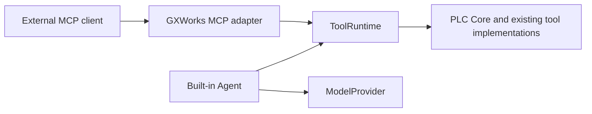

# Standalone GXWorks Agent MCP server

The standalone behavior below remains the default. An additional, explicitly
selected `--service-url` / `--service-token-env` mode connects to the local Web
application's shared proposal store; see [service connection and operator approval](web.md#mcp-的显式服务连接模式).
Agent credentials cannot approve proposals in that mode. MCP is the supported
engineering interface and requires no client skill. Optional client guidance cannot
replace the platform or bypass its tools and approval boundaries.

The stdio server exposes the same twelve high-level tools used by the built-in
agent. External clients discover their current schemas through `tools/list`. The server reads an existing saved
project through SessionStore; it does not launch the desktop or contact a model.



## Install and start

Use a separate Python 3.10+ environment. The optional requirements pin the
[official Python MCP SDK](https://github.com/modelcontextprotocol/python-sdk)
to 2.1.1. The desktop requirements and Windows 7 dependency set are unchanged;
the MCP process is not a Windows 7 build. No PyQt, OpenAI SDK, model API key,
GX Works2, GX Simulator2 or MX Component is needed for this interface.

From the checkout root in Windows PowerShell:

```powershell
python -m venv .venv
.\.venv\Scripts\python.exe -m pip install -r requirements/mcp.txt
$env:PYTHONPATH = (Resolve-Path .\src).Path
$Workspace = '<existing SessionStore workspace directory>'
$ProjectId = '<saved project ID>'
.\.venv\Scripts\python.exe -m integrations.mcp --stdio --workspace $Workspace --project $ProjectId
```

The command waits for an MCP client on stdin. Use the smoke test below for an
automatic check, or configure your agent to launch it. Each stdio connection
launches its own server process. `--stdio` is the default and the only transport
exposed by this CLI. Logs, errors and `--help` go to stderr; stdout contains
protocol data.

Generic shell form, from a checkout with an existing saved workspace:

```sh
python3 -m venv .venv
.venv/bin/python -m pip install -r requirements/mcp.txt
PYTHONPATH="$PWD/src" .venv/bin/python -m integrations.mcp --stdio \
  --workspace '<existing-workspace>' --project '<project-id>' --version v0001
```

The deterministic interface does not require Windows credentials. Live GX and
simulator integration remains Windows-specific; non-Windows execution has not
been validated as part of this change.

## Select a saved engineering context

Point `--workspace` at the desktop's existing SessionStore workspace, which
contains `index.json` and `projects/<project-id>/project.json`. You can instead
set `PLC_AI_WORKSPACE_DIR`. The server deliberately requires an explicit
workspace or that environment variable; it does not guess a Qt application-data
location or create an empty workspace. The desktop's default location is its
`QStandardPaths.AppDataLocation / workspace`.

List saved IDs and active versions using PowerShell:

```powershell
Get-ChildItem -LiteralPath (Join-Path $Workspace 'projects') -Directory |
  ForEach-Object {
    Get-Content -LiteralPath (Join-Path $_.FullName 'project.json') -Raw |
      ConvertFrom-Json
  } | Select-Object id, name, active_version_id
```

`--project` is required. `--version` pins a saved version; when omitted, each
call follows that project's persisted `active_version_id`. A project with no
version supports project summaries, generation context and initial program
candidates. An invalid project, missing selected version, unreadable ladder or
changed metadata returns a context error;
there is no fallback to another project or version. IDs and loaded artifact
paths are checked to stay within their storage directories.

This is saved state. A GUI selection that has not been persisted is not visible.
For a sequence of related engineering calls, pin the version. Each call copies
its own context, and changing metadata during a load is rejected so the client
can retry. Existing saved versions are expected to remain immutable.

`SessionToolContextProvider` reuses SessionStore's project defaults, version
records, canonical IR validation and legacy ladder conversion. It passes
`create=False` and `persist_legacy=False`, so loading never creates a workspace
or writes a migrated IR. Desktop defaults retain migration-on-view. No new
project storage format is introduced.

`StaticToolContextProvider` supplies copied snapshots for embedding and tests.
A future desktop bridge can implement `ToolContextProvider.get_context()` to
return a GUI-selected snapshot without making this adapter depend on widgets.
That bridge and desktop approval delivery are not implemented.

## Tools and results

`tools/list` translates `ToolRuntime.list_tools()` schemas to MCP `inputSchema`;
`SAFE_TOOL_NAMES` filters discovery and calls. The source of definitions remains
`ToolRegistry`, including nested patch schemas. There is no second tool catalog.

Available operations include project/program summaries, generation context,
full or partial ladder candidates, network reads, local manual search, diagnostics,
validation, temporary compilation, candidate patches
and GX import requests. Manual search uses the existing bundled local knowledge
index. Installing NumPy in the MCP environment optionally enables the existing
dense retrieval path; without it the retriever uses its lexical fallback.

Every allowed call becomes a canonical `ToolCall` and passes through
`ToolRuntime.invoke`. Argument validation and PLC behavior remain in the registry
and existing implementations. MCP's result contains:

- `content`: JSON text of the public ToolResult envelope (or the runtime's text
  for a text-only result).
- `structuredContent`: the same public envelope, without the desktop model
  prompt's 18,000-character truncation.
- `isError`: the runtime error flag, with original error codes/messages.
- `_meta.gxworks`: call ID, tool name and, when context was loaded, project and
  version IDs. Incoming client metadata is not echoed.

Runtime errors such as `INVALID_ARGUMENTS` and `TOOL_FAILED` remain tool errors.
Unlisted or forbidden calls return `UNKNOWN_TOOL` without invoking the runtime.
Context failures return `CONTEXT_UNAVAILABLE`; unexpected adapter/runtime
exceptions return a generic error with details only in server logs. Public
status, diffs, hashes, candidate IDs and pending-action fields survive the
boundary. `public_tool_result_data` recursively removes private fields, including
`_candidate_ir` and `_confirmed_spec`; raw `ToolResult.data` is never sent.

## Shared API generation and ordinary edits

The external client supplies the model planning and ladder response. Both first
creation and ordinary edits use `create_program_candidate`; the MCP server
never calls DeepSeek, OpenAI or another model provider to generate a second
answer. The existing API generation path is the acceptance authority.

```text
get_current_project
  → get_generation_context(user_requirement="current request")
  → client designs a full or partial ladder (search_plc_manual if still needed)
  → create_program_candidate → ToolRuntime → PLC Core
      → shared API compatibility normalization and partial materialization
      → structural validation and conservative condition cleanup
      → build_plc_ir and validate_plc_ir(validate_ladder=False)
      → shared API artifacts in a temporary directory
  → status: confirmation_required
```

`get_generation_context` accepts an optional `user_requirement` string, up to
24,000 characters; `{}` remains valid. Other arguments are rejected. Its
`generation_instructions` and `generation_request` use the same API prompt,
output discipline, routing, selected PLC profile, confirmed specification,
current ladder and local RAG assembly in
[`application/generation_context.py`](../../src/application/generation_context.py). The current
request improves routing and retrieval. Automatic generation/edit retrieval
retains the API's policy and budget (five results, 7,000 characters); a retrieval
failure retains the full model profile rather than calling a model or failing
context preparation. `search_plc_manual` remains available for a specific
instruction, timer range or unresolved model fact.

The result also retains `project_id`, `plc_model`, `target_mode`, `workflow_mode`,
`has_confirmed_spec`, `confirmed_spec`, `output_contract` and
`current_version_id`. The specification comes from the selected version
snapshot, or the project when there is no snapshot. It is a field-by-field
engineering projection: confirmed I/O, parameters, selected approach, hardware
and execution constraints remain; unselected approaches, drafts, chat history,
provider configuration, credentials, UI state and private paths do not. Current
ladder context is similarly projected. With no specification the result has
`has_confirmed_spec: false` and `confirmed_spec: null`. The complete stored
specification remains local for candidate construction and binding hashes.

`output_contract.schema` describes the recommended API response: full ladder
JSON, or full/partial alternatives when a current ladder exists. It is output
guidance, not an additional MCP-only validator. The authoritative parser is
[`prepare_ladder_candidate`](../../src/plc/generation.py), shared by the API
workflow and PLC Core.

`create_program_candidate` accepts only these model-owned arguments:

| Property | Accepted input | Required |
| --- | --- | --- |
| `program_name` | Nonblank string, 1–64 characters; omission keeps the current program name, or `MAIN` for first creation | No |
| `ladder` | Object accepted by the shared API parser: full ladder or partial edit | Yes |

A full response supplies `device_comments` and a nonempty `rungs` array. A
partial response uses `mode: "partial"`, optional changed/new complete `rungs`,
`device_comments` updates and `delete_rung_ids`. Partial edits require the bound
current ladder. Unsubmitted rung bodies remain unchanged; new rung insertion
and explicit deletion follow the existing API ordering rules.
An explicit workbench change scope is checked again before proposal creation
and saving.

Compatibility conversion runs before structural checks. Legacy `TIMER` with a
C address becomes `COUNTER`; unambiguous `APP_INSTR OUT` becomes the dedicated
coil, timer or counter output. `BLOCK_OUTPUT` instruction expressions are
converted to typed outputs/application instructions and then face the same
catalogue, CPU, operand and writable-target checks. Unknown instructions do not
bypass validation by using a legacy encoding. Additional rung source fields
accepted by the API remain source data and cannot overwrite derived IR fields.

Hard failures cover malformed containers, unsupported elements, invalid or
out-of-range addresses, unsupported/catalogue-missing instructions, invalid
arity or write targets, invalid identities/partial envelopes, scope escapes and
inconsistent IR. Selected-approach, duplicate-coil, timing-style and other
semantic findings do not add a second acceptance gate. Existing analysis
metadata remains available for diagnostics and Review.

Conservative condition normalization can remove duplicate ordinary conditions,
extract a shared branch prefix or combine adjacent ordinary outputs with the
same conditions. It preserves evaluation position around edges, complex or
stateful operations, unknown side effects and read-after-write dependencies.
It does not OR together repeated writes to the same coil. With a baseline, only
submitted/changed rungs are eligible. `normalization.changes` and `.skipped`
explain actions and exclusions using messages and network IDs, without copied
program bodies. Service-mode proposals and saved versions retain this summary.

The service owns PLC/project/specification binding, `generation_structural`,
revision, candidate IDs and hashes. Revision starts at 1 or advances from the
bound current IR. Canonical networks, instructions, access sets, analysis and
source hashes are computed locally. Clients cannot override these fields.
The profile follows temporary compilation, proposal checks, first/child-version
saving and reload/preview; semantic checks are not silently reapplied during
saving or reading a generated version.

Successful results include structural diagnostics, counts, normalization,
artifact hashes and an `accept_generated_program` pending action. Private
`_candidate_ir`, `_confirmed_spec` and `_validation_profile` stay in-process.
The public result identifies the validation profile and distinguishes structural
acceptance from unexecuted behavior/native verification. A structural or
compilation failure is a tool error. There is no automatic semantic repair or
repeated-submission loop; report the returned error and use an explicitly
requested repair workflow when appropriate.

For explicit scoped Debug work, `read_network → patch_program` retains its
existing revision/hash checks and strict validation. Ordinary edits use the
shared generation path above. Do not edit SessionStore records to bypass either
path. See [generation profiles and boundaries](../architecture/generation-fast-path.md).

## Confirmation and safety

In standalone mode, `create_program_candidate` and `patch_program` validate and
temporarily compile a candidate. They do not save a new project version or
change `active_version_id`.
`import_current_program_to_gxworks2` only prepares an import request.
All three return `status: "confirmation_required"` with a public
`pending_action`, even though `isError` is false. This means preparation succeeded,
not that the action was applied. An MCP client's tool-call approval is not PLC
engineering confirmation.

The standalone server has no approve/accept/commit tool, no auto-approval flag,
no retained candidate queue and no delivery into the desktop's confirmation UI.
Candidate IDs are audit identifiers, not resumable approval tokens. To apply a
change, reproduce and review it in the existing desktop workflow and confirm
there. Do not tell users an MCP proposal has already changed their project or GX
state. The separate Web service mode stores proposals and applies the workbench
approval policy; its Agent credential cannot approve them. Only a returned
saved `version_id` proves that a local version was saved. Neither kind of
receipt proves GX import, native compilation, simulation or PLC execution.

Mouse/keyboard primitives, filesystem deletion, `write_plc`, `force_device` and
unrestricted physical PLC writes are not exposed. Compilation uses the existing
temporary artifact pipeline; generated temporary files are removed by PLC Core.

## Tests and smoke test

With the MCP environment active, run from the checkout root:

```text
python -m pip install -r requirements/mcp.txt pytest
python -m pytest -q tests/test_mcp.py tests/test_architecture_boundaries.py
python scripts/mcp_smoke.py
```

The smoke script creates a temporary persisted project, launches
`python -m integrations.mcp --stdio` as a real subprocess and uses the official
SDK client for `initialize → tools/list → tools/call(read_network)`. It checks
the allow-list and response contents, then starts another subprocess for a
versionless project and calls `get_generation_context → create_program_candidate`.
It asserts `confirmation_required`, zero saved versions, unchanged active version
and unchanged workspace contents. Both child processes close and the temporary
workspace is removed. It exits nonzero on failure. No model or network is
used. The SDK negotiates protocol versions; the explicit initialize smoke test
exercises its legacy-session compatibility, while in-memory SDK client tests
also exercise the current connection flow.

Tests cover discovery, schema fidelity, invocation, invalid and unknown calls,
errors, pending confirmations, large structured results, recursive redaction,
snapshot selection, non-writing legacy reads and import boundaries. A separate
real subprocess test rejects imports of Qt, `api`, `model_provider`, model
settings/credentials and device automation, and injects Python/native stdout
noise to verify that only MCP messages reach the client.

Run the full desktop suite in an environment with the appropriate desktop
requirements plus the optional MCP requirements:

```text
python -m pytest -q
```

Without the optional SDK, the MCP test module is skipped. That does not count
as MCP validation. The existing live GX availability tests may skip when GX
Works2 is not running or no program is open.

For an optional interactive check with Node.js 22.19+ and
[MCP Inspector](https://github.com/modelcontextprotocol/inspector), set PYTHONPATH
as above, then run:

```powershell
npx @modelcontextprotocol/inspector .\.venv\Scripts\python.exe -- -m integrations.mcp --stdio --workspace $Workspace --project $ProjectId
```

Inspector may download packages; it is not required by the offline tests.
Connect over stdio, list tools and call `get_current_project` with `{}`.

## Future boundaries

`create_server(context_provider, runtime=None)` returns an SDK server independently
of `serve_stdio`. A future Streamable HTTP transport can reuse it and the same
ToolRuntime, with separate authentication, session isolation and context binding.
No HTTP endpoint or remote-access configuration is shipped here.

[Codex as an MCP client](codex.md) is supported by this interface. Embedding
Codex Harness/App Server is a separate, planned integration.
