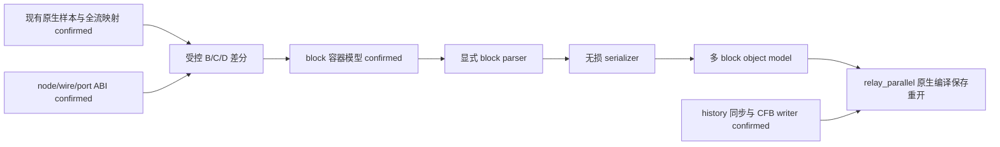

# Structured Ladder/FBD block/network 边界研究（2026-09-13）

范围只包含 network/梯形图块组织和 C2034；不增加其他 element ABI，不研究 MAIN.res 格式。全部实验使用离线副本。当前目标已完成：writer 生成的 `relay_parallel` 在 GX Works2 1.635.0.1 / FX3U 完成 open→Compile All→save→close→reopen，Error=0、Warning=0、CheckWarning=0，两个 block 保持独立。

## 采样前的可证伪假设

| ID | 假设 | 排除方法 |
| --- | --- | --- |
| H-record | block 由 node/wire 列表内新的 record class、node kind 或 separator 表示 | 对 B/C 做完整 record alignment，检查所有插入/删除字节是否属于其他层级 |
| H-envelope | Program.pou 在 record 列表外有每 block 的 envelope、长度和计数 | C/D 完整重排 envelope，且 block 内记录独立保持；受控 B→C mutation |
| H-other | block 边界只在其他 source/editor logical stream 中 | Program.pou 单流移植能改变 block 数并消除 C2034 时排除“只在其他流” |
| H-geometry | block 仅由现有 wire/rail/节点几何推导 | 保持逻辑图、对齐 block 局部坐标，观察非几何结构及移植结果 |
| H-identity | 候选 block DWORD 是稳定 identity | 交换 block 顺序，比较数值跟随内容还是位置；不能只由两个相等常量下结论 |

## 最小原生矩阵（预注册）

用已知直接器件与空声明基线，首条 `X1→Y1`，第二条 `X2→Y2`。B/C/D 中器件、逻辑和声明相同。

| 样本 | 组织 | 与对照的唯一编辑语义变化 |
| --- | --- | --- |
| A | 1 block / 1 简单梯形图 | 原生基线 |
| B | 1 block / 2 独立梯形图 | A 加第二条逻辑；这是计数基线，不作为纯组织因果对照 |
| C | 2 blocks / 各 1 梯形图 | B 将第二条移动到独立 block；局部坐标重定位是编辑器附带变化，单独列出 |
| D | 与 C 相同，交换 block 顺序 | 仅顺序；区分 identity、ordering 与 count |
| E | 在 A 上增加空 block（如编辑器允许） | 空 block 的结构控制；与 C 删除第二条逻辑不同，不冒充语义等价 |

每个样本分别保存编辑后/编译后快照，记录 open→compile all→save→close→reopen；全流 SHA-256、长度、XML 字段 diff、record alignment 与二进制 diff 都进入结果 JSON。重复无编辑保存用于发现 save noise；未经隔离的字段不丢弃、不命名为格式规则。

## 审查与阻塞关系

已复用：两层 CFB、当前 logical mapping、node/wire/port ABI、几何 nets、已有 serializer、allocation、history 同步、声明、既有原生闭环。历史文档中的“未实现”以日期与后续证据为准。

已确认现有实现只表达一段 record 列表，不能据此推导原生格式只有一块。既有 `relay_parallel` 原生记录为 Error=0 / Warning=1(C2034) / CheckWarning=0。



## 原生矩阵与单流因果实验

已完成 A/B/C/D/E 的原生编辑、全部编译、保存、关闭、重开。B/C/D 始终使用同一工作文件名 `E.gxw`；不可变副本以矩阵代号命名。A→E 的 Save As 同时更改工程名，故不把该对照的全部 metadata 差异归因于 block。

| 样本 | Program.pou 长度 | block 长度 / height / records | Error / Warning / CheckWarning |
| --- | ---: | --- | --- |
| A | 411 | 316 / 5 / 5 | 0 / 0 / 0 |
| B | 659 | 564 / 6 / 9 | 0 / 1(C2034) / 0 |
| C | 727 | 316 / 5 / 5；316 / 5 / 5 | 0 / 0 / 0 |
| D | 727 | C 的两个完整 block 字节交换 | 0 / 0 / 0 |
| E | 479 | 316 / 5 / 5；68 / 5 / 1 | 0 / 1(C2008 空块仅划线) / 0 |

B 在 C 的基础上，通过原生剪切第二条图形并粘贴到第一块、删除移空块得到。B 的第二条 bbox.y 为 4..6，C 为 2..4；wire 同步平移 2 个格，B 共用一条 height=6 的 rail，C 各有 height=5 的 rail。器件、局部端口、两条逻辑和声明保持。B/C 原生编译后的 `MAIN.res` SHA-256 相同，仅作不透明比较，未修改或研究其内部格式。

M1 保留 B 的所有非目标 nested payload 与全部其他 outer payload，只把 C 的 native block 容器写入 B 的 `1.Program.pou`，更新 0x37/0x3B 的长度和 0x43 的 block count，保留 B 前缀其余字节（含时间戳及编译状态）。复用已有 history size/已识别 MD5 同步。`M1-mutation.json` 确认唯一改变的 logical stream 是 `1.Program.pou`。M1 原生打开即呈现两块，全部编译为 0/0/0；编译保存未改变任何 Program.pou 字节；关闭、重开后两块仍独立。实际操作记录与 parser 比较分开保存在 manifest 和 `M1-parsed-roundtrip.json`。

## 边界模型

目前 native A–E 支持以下 envelope 模型，M1 提供 source-only 行为证据：

```text
71-byte program prefix
  u32 @0x37, @0x3B = Program.pou 总长度 - 83（当前样本族）
  u32 @0x43 = block 数量
重复 block 数量次：
  24-byte block header
    +0  u32 = 此 block 的总字节数（header + records）
    +4..+15 = 12 个未命名字节，原样保留
    +16 u32 = 此 block 的画布高度
    +20 u32 = 此 block 的 record 数量
  count 个已有 length-delimited node/wire/opaque records
24 个零字节的 program trailer
```

A 的 block 从 71 到 387；E 在 387 插入一个 68-byte block，A 原 block 完全未变。C 的第二个 block 同样从 387 开始，两个 block 都使用相同的局部坐标：contact `(5,2)-(7,4)`、coil `(8,2)-(10,4)`。因此 connectivity 必须按 block 隔离，不能把不同块中相同坐标的 ports 合并。

D 将 C 两个 block 的完整字节精确交换。边界不是 record list 内的新 class、node kind 或 separator（H-record 在此样本范围排除）；顺序就是容器顺序。重复的 header 常量不具备区分 identity 的信息，不能命名为 block ID。page 及未命名字节的进一步含义仍未知。

旧单块解析器把 0x47 误当作全 program 的 body size：单块时 24-byte block header 与 24-byte trailer 刚好抵消，`len-95` 的关系成立；多块时该推论失败。该结论只修正外层 framing，不重做已确认 record ABI。

D 重开后无编辑保存时 Program.pou SHA-256 完全不变；CallTree、DeviceAssignment、工程/编译缓存有变化。结果 JSON 保留全部字节，不按猜测过滤 timestamp/save noise。

## 已实现与验证结果

生产 `StructuredBlock` 显式保存容器 header、局部画布高度和 record membership，`StructuredProgram.blocks` 的顺序就是序列化顺序。record 数据仍由原有 nodes/wires/unknown_records 集合持有，避免重复维护两份记录。`block_records()` 校验多块 membership 是全部记录的完整、不重复分区；`block_views()` 提供独立局部画布。单块编辑 API 仍将所有记录归入唯一 block，保留已有插入/改名调用的兼容性。

parser 按 block length/count 限定读取边界；越界、计数异常、未消耗的容器字节、未知 trailer 均拒绝。serializer 重算整体长度、block count、每块 length/count/height，保留其余 header 字节及未知 record。object model 导出新增 `blocks: [{source_offset, canvas_height}]`，nodes/wires 使用从零开始的 `block` 索引；新 block 可以省略 source_offset，复用已有 native header 模板。命名端口连线不能跨块。含未知记录的原 block 必须显式保留其来源绑定，不能静默删除或重新分配。

`ladder_to_object_model()` 将每条 rung 放入独立 block，内部串并联与多个输出保留在该 block 内。connectivity 按块计算后汇总，SVG 预览也分别放置局部画布。旧 `structured_from_ladder()` 的单串联生成接口维持原有范围；完整 relay 输入使用 object-model 生成入口。

原始 `relay_parallel_source.json` 从旧证据包原样提取为 `research/models/relay-parallel.json`。新生成结果 R 的第一块含 `X0/X1/NC X2/Y0/Y1`，height=12、length=1084；第二块含 `X3/Y2`，height=9、length=360。Program.pou 长度 1539。真实 GX Works2 1.635.0.1 全部编译后 0/0/0，保存、关闭、重开后两块仍独立。

| 工件 | SHA-256 |
| --- | --- |
| R.gxw，生成结果 | `56e78a3475831781c559533bc7af1a162881bd52ca95be515e6386a240e85f05` |
| R_compile.gxw，原生编译保存 | `082f66dd2e5f7dea4e665cbb79054a631eabed6e3fca16f5970037068e70933b` |
| 两者相同的 Program.pou | `00b49a57cbf4dac6ef9a97488ca09c220224ca183ad31825b5392abe1b174cee` |

`R-compile-diff.json` 的 block、device、topology、wire、semantic_graph、unknown_records 检查全部相等；完整 POU 也逐字节相同。基于读取后源图的独立有界真值表检查，全部 16 种 X0..X3 组合均满足 `Y0=Y1=X0 AND (X1 OR NOT X2)`、`Y2=X3`，且与旧单块生成结果相同。该计算是源语义检查，原生编译结论来自独立 GUI 观察。

C2034 的行为根因在这些控制中已经隔离为：两条独立梯形图被写入同一个 block 容器。没有声称逆向出编译器检测 C2034 的全部内部算法。新增支持只建立在本样本族，不把未命名字段解释成 identity 或 page；其他 CPU/版本尚未验证。

## 可重放的证据入口

- [完整审查索引](../../research/results/block-boundary-20260913/audit.json)：研究开始时指定文件、模型、原生证据及测试的完整审查清单。
- [知识账本](../../research/results/block-boundary-20260913/knowledge-ledger.json)：每条结论的四态状态、样本、变量、logical stream、原生验证和反例。
- [原生 A–E/M1 证据包](../../research/evidence/gxw-block-boundary-20260913.zip) 与 [逐文件 manifest](../../research/results/block-boundary-20260913/evidence-manifest.json)：12 个不可变 GXW 快照及 17 张截图。
- [R 生成闭环证据包](../../research/evidence/gxw-block-generation-20260913.zip) 与 [原生结果和语义 manifest](../../research/results/block-boundary-20260913/generation-evidence-manifest.json)：生成/原生保存两个 GXW 和三个操作截图。
- [B/C 字段与 record 对齐](../../research/results/block-boundary-20260913/B-C-parsed.json)、[C/D 顺序对齐](../../research/results/block-boundary-20260913/C-D-parsed.json)、[M1 最小 mutation](../../research/results/block-boundary-20260913/M1-mutation.json)、[R 编译前后全流差分](../../research/results/block-boundary-20260913/R-compile-diff.json)。旧 pre-parser 报告保留当时 parser 拒绝多块的状态，后缀 `parsed` 的报告使用新 parser 重算。
- [回归 fixture](../../tests/fixtures/gxw_network_blocks_20260913.json) 与 [新测试](../../tests/test_gxw_network_blocks.py)：包括边界破坏、重复/遗漏 membership、未知字节、跨块连线拒绝、归档 hash 和原生结果逐字节重建。全部 `tests/test_gxw_*.py`：256 passed。

复现时先把证据包解压到新目录，所有输出使用尚不存在的路径：

```text
python research/probe_block_boundaries.py <samples/B.gxw> <samples/C.gxw> <new/B-C.json>
python research/mutate_block_boundary.py <samples/B.gxw> <samples/C.gxw> <new/M1.gxw> <new/M1.json>
python tools/gxw_project.py fbd research/models/relay-parallel-blocks.json -o <new/R.gxw> --report <new/R.json>
```

再次原生验证：在离线 GX Works2 中打开新 R，检查左侧序号 1/2；选择“转换/编译 → 转换+全部编译”，保持编译后检查勾选，记录三类计数；保存，使用“工程 → 关闭”直至空工作区，再打开同文件；确认两块独立，用 diff 工具比较保存前后。全部步骤不涉及在线菜单或真实 PLC。

下一项信息增益最高的边界实验：在 native C 末尾只添加一个空 block，原两块记录与顺序不动。竞争假设是“容器计数支持一般 N”与“第三块需要额外索引/布局结构”。若原两个容器完全未变、只追加 68-byte 空块并更新总长度/count，即可检验 N=3 扩展；随后只改变第三块 height，进一步隔离 geometry 与仍未知的 12-byte header 区域。该实验尚未执行，不属于本次已确认结论。
